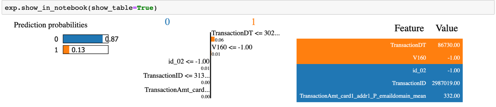

# Explaining black box models-Ensemble and Deep Learning using LIME and SHAP


In this world of ever increasing data at a hyper pace, we use all kinds of complex ensemble and deep learning algorithms to achieve the highest possible accuracy. It’s sometimes magical how these models predict/classify/recognize/track on unknown data. And accomplishing this magic and more has been and would be the goal of intensive research and development in the data science community. But, around all this great work, a question arises, can we always trust this prediction/classification /recognition/tracking? A variety of reasons, like lack of data, imbalanced datasets, biased datasets etc. can impact the decision rendered by the learning models. Models are gaining traction for explainability. Financial institutions and law agencies, for example demand explanations and evidences (SR 11–7 and The FUTURE of AI Act) bolstering the output of these learning models.

I am going to demonstrate explainability on the decisions made by LightGBM and Keras models in classifying a transaction for fraudulence on the IEEE CIS dataset . I would use two state of the art open source explainability techniques in this article, namely LIME (https://github.com/marcotcr/lime) and SHAP (https://github.com/slundberg/shap) from these research papers (1, 2). I have saved another great open source explainability technique - AIX360 (https://github.com/IBM/AIX360) for my next post as it proposes 8 novel algorithms by itself for explainability.

I have borrowed the awesome feature engineering techniques on this dataset from here (https://www.kaggle.com/cdeotte/xgb-fraud-with-magic-0-9600). Additionally, I have used feature scaling to even out the variability in the magnitude of feature values.

## LIME
Intuitively, an explanation is a local linear approximation of the model's behaviour. While the model may be very complex globally, it is easier to approximate it around the vicinity of a particular instance. While treating the model as a black box, LIME perturbs the instance desired to explain and learn a sparse linear model around it, as an explanation. The figure below illustrates the intuition for this procedure. The model's decision function is represented by the blue/pink background, and is clearly nonlinear. The bright red cross is the instance being explained (let's call it X). We sample instances around X, and weight them according to their proximity to X (weight here is indicated by size). We then learn a linear model (dashed line) that approximates the model well in the vicinity of X, but not necessarily globally. For more information, read this paper, or take a look at this blog post (https://github.com/marcotcr/lime).


LIME Technique (https://github.com/marcotcr/lime)

### Ensemble model - LightGBM
Below is my model configuration. I have got an auc score of 0.972832 for this model.

```
##### Create training and validation sets
x_train, x_test, y_train, y_test = train_test_split(x, y, test_size=0.30, random_state=42)
##### Train the model
parameters = {
    'application': 'binary',
    'objective': 'binary',
    'metric': 'auc',
    'is_unbalance': 'true',
    'boosting': 'gbdt',
    'num_leaves': 31,
    'feature_fraction': 0.5,
    'bagging_fraction': 0.5,
    'bagging_freq': 20,
    'learning_rate': 0.05,
    'verbose': 0
}
model = lightgbm.train(parameters,
                       train_data,
                       valid_sets=test_data,
                       num_boost_round=5000,
                       early_stopping_rounds=100)
y_pred = model.predict(x_test)
```
This the classification report of the above model.
```
from sklearn.metrics import classification_report
print(classification_report(y_test, y_pred_bool))
```


Before, I explore the formal LIME and SHAP explainability techniques to explain the model classification results, I thought why not use LightGBM's inbuilt 'feature importance' function to visually understand the 20 most important features which helped the model lean towards a particular classification.

```
feature_imp= pd.DataFrame({'Value':model.feature_importance(),'Feature':X.columns})
plt.figure(figsize=(40, 20))
sns.set(font_scale = 5)
sns.barplot(x="Value", y="Feature", data=feature_imp.sort_values(by="Value", ascending=False)[0:20])
plt.title('LightGBM Features (avg over folds)')
plt.tight_layout()
plt.savefig('lgbm_importances-01.png')
plt.show()
```


Top 20 important features in the LightGBM model above

Having seen the top 20 crucial features enabling the model, let us dive into explaining these decisions through few amazing open source python libraries, namely LIME (https://github.com/marcotcr/lime) and SHAP (https://github.com/slundberg/shap).
The code for using LIME to explain the decisions made by model is simple and takes few lines.

```
def prob(data):
    return np.array(list(zip(1-model.predict(data),model.predict(data))))
import lime
import lime.lime_tabular
explainer = lime.lime_tabular.LimeTabularExplainer(new_df[list(X.columns)].astype(int).values,  
mode='classification',training_labels=new_df['isFraud'],feature_names=list(X.columns))
```
I would use this explainer to explain any random instance as follows:
```
i = 2
exp = explainer.explain_instance(new_df.loc[i,list(X.columns)].astype(int).values, prob, num_features=10)
##visualize the result
exp.show_in_notebook(show_table=True)
```


### Deep Learning model - Keras (tensorflow)

I have attempted to explain the decisions of my neural network (Keras) model as below. The model is configured as follows.
```
classifier = Sequential()
#First Hidden Layer
classifier.add(Dense(16, activation='sigmoid', kernel_initializer='random_normal', input_dim=242))
#Second  Hidden Laye
classifier.add(Dense(8, activation='sigmoid', kernel_initializer='random_normal'))
#Output Layer
classifier.add(Dense(1, activation='sigmoid', kernel_initializer='random_normal'))
```
This the classification report of the above model.
```
from sklearn.metrics import classification_report
y_pred=classifier.predict(X_test, batch_size=64, verbose=1)
y_pred =(y_pred>0.5)
y_pred_bool = np.argmax(y_pred, axis=1)
print(classification_report(Y_test, y_pred_bool))
```


Following is the code for LIME explainer for the results of the above Keras model.
```
def prob(data):
    print(data.shape)
    y_pred=classifier.predict(data).reshape(-1, 1)
    y_pred =(y_pred>0.5)
    print(np.array(list(zip(1-y_pred.reshape(data.shape[0]),y_pred.reshape(data.shape[0])))))
    return np.hstack((1-y_pred,y_pred))
    
import lime
import lime.lime_tabular
explainer = lime.lime_tabular.LimeTabularExplainer(X[list(X.columns)].astype(int).values,  
mode='classification',training_labels=new_df['isFraud'],feature_names=list(X.columns))
```
I would use the above explainer to explain any random instance as below.
```
i = 19
exp = explainer.explain_instance(X.loc[i,X.columns].astype(int).values, prob, num_features=5)
```



## SHAP (SHapley Additive exPlanations)
The beauty of SHAP (SHapley Additive exPlanations) lies in the fact that it unifies all available frameworks for interpreting predictions. SHAP assigns each feature an importance value for a particular prediction. Its novel components include: (1) the identification of a new class of additive feature importance measures, and (2) theoretical results showing there is a unique solution in this class with a set of desirable properties. The new class unifies six existing methods, notable because several recent methods in the class lack the proposed desirable properties. Based on insights from this unification, it presents new methods that show improved computational performance and/or better consistency with human intuition than previous approaches.
```
### Ensemble model - LightGBM
import shap
##### load JS visualization code to notebook
shap.initjs()
##### explain the model's predictions using SHAP values (this syntax works for LightGBM, CatBoost, scikit-learn and spark models)
explainer = shap.TreeExplainer(model)
shap_values = explainer.shap_values(X)
##### visualize the first prediction's explanation (use matplotlib=True to avoid Javascript)
shap.force_plot(explainer.expected_value, shap_values[0,:], X.iloc[0,:])
```

The above explanation shows features each contributing to push the model output from the base value (the average model output over the training dataset we passed) to the model output. Features pushing the prediction higher are shown in red, those pushing the prediction lower are in blue (these force plots were introduced in the Nature BME paper). If we take many explanations such as the one shown above, rotate them 90 degrees, and then stack them horizontally, we can see explanations for an entire dataset.
```
shap.dependence_plot("TransactionAmt", shap_values, X)
```

To understand how a single feature affects the output of the model we can plot the SHAP value of that feature vs. the value of the feature for all the examples in a dataset. Since SHAP values represent a feature's responsibility for a change in the model output, the plot below represents the change in predicted house price as TransactionAmt (the amount in the transaction) changes. Vertical dispersion at a single value of TransactionAmt represents interaction effects with other features. To help reveal these interactions dependence_plot automatically selects another feature for coloring. In this case coloring by V284 highlights that the average number of TransactionAmt has less impact on fraud probability for cases with a high V284 value.
```
##### summarize the effects of all the features
shap.summary_plot(shap_values, X)
```

To get an overview of which features are most important for a model we can plot the SHAP values of every feature for every sample. The plot below sorts features by the sum of SHAP value magnitudes over all samples, and uses SHAP values to show the distribution of the impacts each feature has on the model output. The color represents the feature value (red high, blue low). This reveals for example that a card holder address has a high impact on its predicted fraudulent status.
```
shap.summary_plot(shap_values, X, plot_type="bar")
```

We can also just take the mean absolute value of the SHAP values for each feature to get a standard bar plot

### Deep Learning model - Keras (tensorflow)
In a similar way as LightGBM, we can use SHAP on deep learning as below; but this time we would use the keras compatible DeepExplainer instead of TreeExplainer.
```
import shap
import tensorflow.keras.backend 
background = X_train[np.random.choice(X_train.shape[0], 100, replace=False)]
##### we use the first 100 training examples as our background dataset to integrate over
explainer = shap.DeepExplainer(classifier,  background)
```

Features pushing the prediction higher are shown in red, those pushing the prediction lower are in blue (these force plots are introduced in the Nature BME paper).


We can also just take the mean absolute value of the SHAP values for each feature to get a standard bar plot

## Differences between SHAP and LIME
LIME creates a surrogate model locally around the unit who's prediction you wish to understand. Thus it is inherently local. Shapely values 'decompose' the final prediction into the contribution of each attribute - this is what some mean by 'consistent' (the values add up to the actual prediction of the true model, this is not something you get with LIME). But to actually get the shapely values there is some decision that must be made about what to do/how to handle the values of the attributes 'left out', this is how the values are arrived at. In this decision there is some choice which could change the interpretation. If I 'leave out' an attribute do I average all the possibilities? Do choose some 'baseline'? So Shapely actually tells you, in an additive way, how you got your score, but there is some choice about the 'starting point' (i.e. the decision about omitted attributes). LIME simply tells you, in a local sense, what is the most important attribute around the data point of interest.

In production, we can use the following architecture to share model explainability with the stakeholders.


## References
```
https://stats.stackexchange.com/questions/379744/comparison-between-shap-shapley-additive-explanation-and-lime-local-interpret
LIME - https://github.com/marcotcr/lime
SHAP - https://github.com/slundberg/shap
```

Please feel free to ask questions if any in the comments section.


